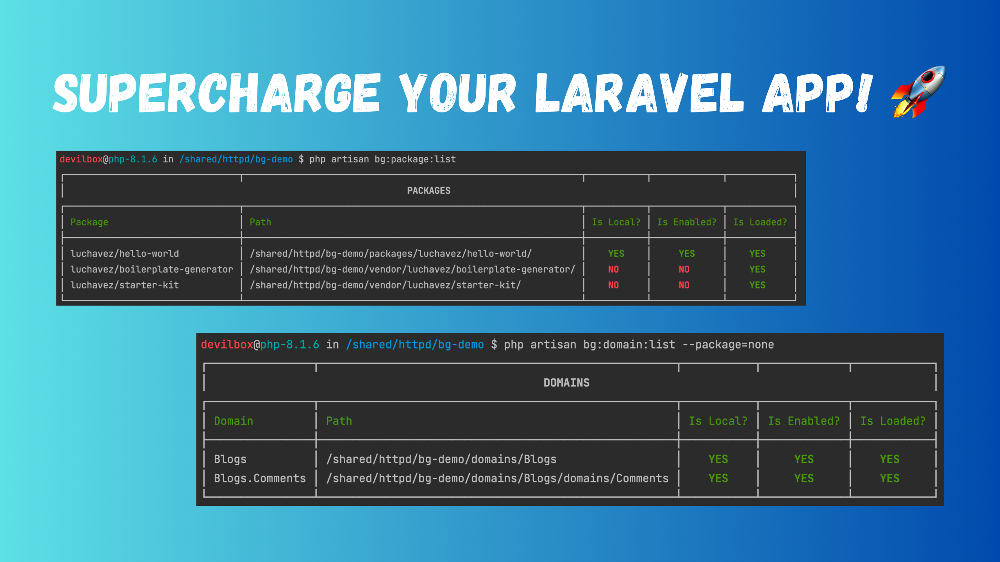
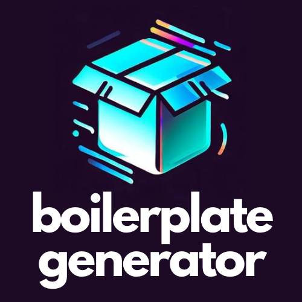

# Boilerplate Generator

[![Latest Version on Packagist][ico-version]][link-packagist]
[![Total Downloads][ico-downloads]][link-downloads]



If you're developing a Laravel app, you know how quickly it can grow and become complex. You don't want to end up with a messy codebase that's hard to maintain and debug. You need a way to organize your code into modular and reusable packages and domains that imitates the `Domain-Driven Design (DDD)` principles.

That's where `luchavez/boilerplate-generator` comes in handy. It's a Laravel package that helps you create, manage, and publish your own packages and domains with ease. It also provides a set of handy commands to generate common classes such as controllers, models, casts, components, and more.

With `luchavez/boilerplate-generator`, you can keep your Laravel app clean, structured, and scalable. You can also share your packages with the world or use them in other projects. It's the ultimate tool for Laravel developers who want to level up their skills and productivity.

<p align="center"></p>

## Installation

```bash
composer require luchavez/boilerplate-generator --dev
php artisan bg:install            // executes a series of steps necessary to utilize the package
php artisan bg:env:publish --all  // publishes predefined env variables to the `.env` file
```

## Usage

### List of `bg:package` commands

| Name            | Command              | Description                                                                        |
|-----------------|----------------------|------------------------------------------------------------------------------------|
| Package List    | `bg:package:list`    | List all locally installed packages.                                               |
| Package Create  | `bg:package:create`  | Create a new Laravel package.                                                      |
| Package Remove  | `bg:package:remove`  | Remove a Laravel package.                                                          |
| Package Enable  | `bg:package:enable`  | Enable a Laravel package.                                                          |
| Package Disable | `bg:package:disable` | Disable a Laravel package.                                                         |
| Package Clone   | `bg:package:clone`   | Clone a Laravel package using Git.                                                 |
| Package Publish | `bg:package:publish` | Publish a Laravel package using Git.                                               |

### List of `bg:domain` commands

| Name           | Command             | Description                         |
|----------------|---------------------|-------------------------------------|
| Domain List    | `bg:domain:list`    | List all locally installed domains. |
| Domain Create  | `bg:domain:create`  | Create a new Laravel domain.        |
| Domain Remove  | `bg:domain:remove`  | Remove a Laravel domain.            |
| Domain Enable  | `bg:domain:enable`  | Enable a Laravel domain.            |
| Domain Disable | `bg:domain:disable` | Disable a Laravel domain.           |

### List of `bg:make` commands

| Type                 |        Command         | Laravel Counterpart | Description                                                                  |
|----------------------|:----------------------:|:-------------------:|:-----------------------------------------------------------------------------|
| Cast                 |     `bg:make:cast`     |     `make:cast`     | Create a new custom Eloquent cast class in Laravel or in a specific package. |
| Channel              |   `bg:make:channel`    |   `make:channel`    | Create a new channel class in Laravel or in a specific package.              |
| Class                |    `bg:make:class`     |          ❌          | Create a new PHP class in Laravel or in a specific package.                  |
| Command              |   `bg:make:command`    |   `make:command`    | Create a new Artisan command in Laravel or in a specific package.            |
| Component            |  `bg:make:component`   |  `make:component`   | Create a new view component class in Laravel or in a specific package.       |
| Config               |    `bg:make:config`    |          ❌          | Create a new view component class in Laravel or in a specific package.       |
| Controller           |  `bg:make:controller`  |  `make:controller`  | Create a new controller class in Laravel or in a specific package.           |
| Data                 |     `bg:make:data`     |          ❌          | Create a new data class in Laravel or in a specific package.                 |
| Data Factory         |      `bg:make:df`      |          ❌          | Create a new data factory class in Laravel or in a specific package.         |
| Data Transfer Object |     `bg:make:dto`      |          ❌          | Create data tranfer object (DTO) files in Laravel or in a specific package.  |
| Event                |    `bg:make:event`     |    `make:event`     | Create a new event class in Laravel or in a specific package.                |
| Exception            |  `bg:make:exception`   |  `make:exception`   | Create a new custom exception class in Laravel or in a specific package.     |
| Facade               |    `bg:make:facade`    |          ❌          | Create a new facade in Laravel or in a specific package.                     |
| Factory              |   `bg:make:factory`    |   `make:factory`    | Create a new model factory in Laravel or in a specific package.              |
| Helper               |    `bg:make:helper`    |          ❌          | Create a new helper file in Laravel or in a specific package.                |
| Interface            |  `bg:make:interface`   |          ❌          | Create a new interface in Laravel or in a specific package.                  |
| Job                  |     `bg:make:job`      |     `make:job`      | Create a new job class in Laravel or in a specific package.                  |
| Listener             |   `bg:make:listener`   |   `make:listener`   | Create a new event listener class in Laravel or in a specific package.       |
| Mail                 |     `bg:make:mail`     |     `make:mail`     | Create a new email class in Laravel or in a specific package.                |
| Middleware           |  `bg:make:middleware`  |  `make:middleware`  | Create a new middleware class in Laravel or in a specific package.           |
| Migration            |  `bg:make:migration`   |  `make:migration`   | Create a new migration file in Laravel or in a specific package.             |
| Model                |    `bg:make:model`     |    `make:model`     | Create a new Eloquent model class in Laravel or in a specific package.       |
| Notification         | `bg:make:notification` | `make:notification` | Create a new notification class in Laravel or in a specific package.         |
| Observer             |   `bg:make:observer`   |   `make:observer`   | Create a new observer class in Laravel or in a specific package.             |
| Policy               |    `bg:make:policy`    |    `make:policy`    | Create a new policy class in Laravel or in a specific package.               |
| Provider             |   `bg:make:provider`   |   `make:provider`   | Create a new service provider class in Laravel or in a specific package.     |
| Repository           |  `bg:make:repository`  |          ❌          | Create a new repository class in Laravel or in a specific package.           |
| Request              |   `bg:make:request`    |   `make:request`    | Create a new form request class in Laravel or in a specific package.         |
| Resource             |   `bg:make:resource`   |   `make:resource`   | Create a new resource file in Laravel or in a specific package.              |
| Routes               |    `bg:make:route`     |          ❌          | Create new route file in Laravel or in a specific package.                   |
| Rule                 |     `bg:make:rule`     |     `make:rule`     | Create a new validation rule in Laravel or in a specific package.            |
| Scope                |    `bg:make:scope`     |          ❌          | Create a new scope class in Laravel or in a specific package.                |
| Seeder               |    `bg:make:seeder`    |    `make:seeder`    | Create a new seeder class in Laravel or in a specific package.               |
| Container            |   `bg:make:service`    |          ❌          | Create a new service container in Laravel or in a specific package.          |
| Test                 |     `bg:make:test`     |     `make:test`     | Create a new test class in Laravel or in a specific package.                 |
| Trait                |    `bg:make:trait`     |          ❌          | Create a new interface in Laravel or in a specific package.                  |

### Other `bg` commands

| Name           | Command             | Description                                                         |
|----------------|---------------------|---------------------------------------------------------------------|
| AWS EB Configs | `bg:aws:publish`    | Publish all basic AWS related configuration for deployment.         |                            |
| Describe       | `bg:describe`       | Display all information about Laravel app and/or package/s.         |                            |
| Docs           | `bg:docs`           | Generate Scribe documentations.                                     |                            |
| Env Variables  | `bg:env:publish`    | Publish all environment variables from root, packages, and domains. |                            |
| Gitlab CI      | `bg:gitlab:publish` | Create a Gitlab CI YML file in a specific package.                  |                            |
| Install        | `bg:install`        | Setup your Laravel application to utilize the package.              |
| Clear Logs     | `bg:log:clear`      | Clear laravel.log contents.                                         |
| Test           | `bg:test`           | Run the application and package tests.                              |

## Change log

Please see the [changelog](changelog.md) for more information on what has changed recently.

## Contributing

Please see [contributing.md](contributing.md) for details and a todolist.

## Security

If you discover any security related issues, please email jamescarloluchavez@gmail.com instead of using the issue tracker.

## Credits

- [James Carlo Luchavez][link-author]
- [All Contributors][link-contributors]

## License

MIT. Please see the [license file](license.md) for more information.

[ico-version]: https://img.shields.io/packagist/v/luchavez/boilerplate-generator.svg?style=flat-square
[ico-downloads]: https://img.shields.io/packagist/dt/luchavez/boilerplate-generator.svg?style=flat-square

[link-packagist]: https://packagist.org/packages/luchavez/boilerplate-generator
[link-downloads]: https://packagist.org/packages/luchavez/boilerplate-generator
[link-author]: https://github.com/luchavez-technologies
[link-contributors]: ../../contributors
